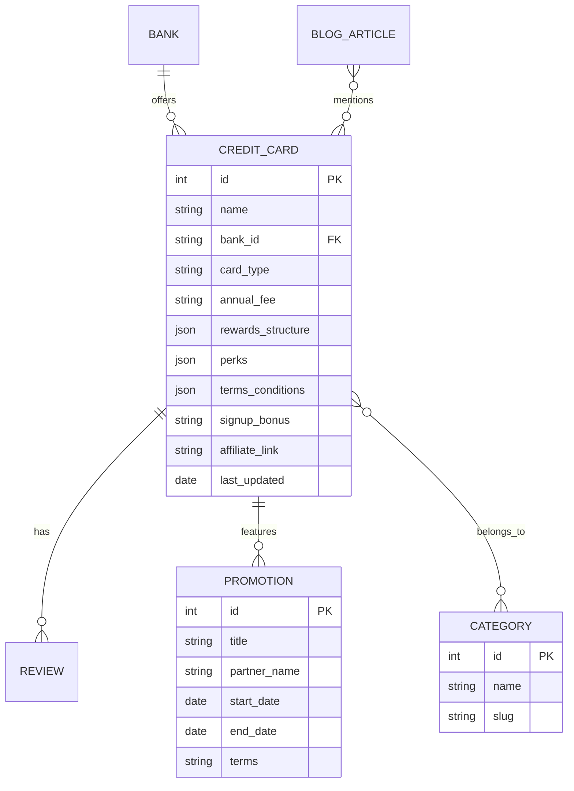

# Credit Card Comparison Website - Implementation Plan

A comprehensive credit card comparison platform for **Malaysia & Singapore**, featuring all card types, interactive comparison tools, calculators, CMS, partner promotions, and automated web crawling for weekly updates.

---

## User Review Required

> [!IMPORTANT]
> **Please choose your preferred website name from the options below.** This will be used for branding, logo design, and domain registration.

### Website Name Suggestions

| Name | Domain Ideas | Rationale |
|------|-------------|-----------|
| **CardWise.my** | cardwise.my, cardwise.sg | Smart/wise card choices, clean & professional |
| **SwipeRight** | swiperight.my | Catchy, modern dating-app reference for "choosing right" |
| **CardPanda** | cardpanda.my | Friendly, memorable, appeals to Asian market |
| **PlasticPoints** | plasticpoints.com | References plastic cards & reward points |
| **CardGenius** | cardgenius.my | Expertise positioning, helpful & smart |
| **RewardRanger** | rewardranger.com | Adventure/explorer theme for reward hunters |

---

## Tech Stack Decision

| Component | Technology | Rationale |
|-----------|-----------|-----------|
| **Frontend** | Next.js 14 (App Router) | SEO-optimized, fast, React-based |
| **Styling** | Tailwind CSS | Rapid development, white/blue theme |
| **CMS** | Strapi (Headless) | Open-source, self-hosted, flexible API |
| **Database** | PostgreSQL | Robust, relational data for cards/reviews |
| **Web Crawling** | Puppeteer + Node.js | Handles dynamic bank websites |
| **Scheduler** | Node-cron | Weekly automated crawl jobs |
| **Newsletter** | Mailchimp/Resend API | Email list management |
| **Hosting** | Vercel (Frontend) + Railway (Backend) | Fast, scalable, affordable |

---

## Proposed Changes

### Core Application Structure

```
credit-card-website/
├── frontend/                 # Next.js application
│   ├── app/
│   │   ├── page.tsx         # Homepage
│   │   ├── cards/           # Card listings & comparison
│   │   ├── reviews/         # Individual card reviews
│   │   ├── blog/            # Articles & guides
│   │   ├── calculators/     # Miles & rewards calculators
│   │   ├── promotions/      # Partner promotions
│   │   └── best-of/         # Best card recommendations
│   ├── components/
│   └── styles/
├── backend/                  # Strapi CMS
│   ├── src/api/
│   │   ├── credit-card/
│   │   ├── review/
│   │   ├── blog-article/
│   │   ├── promotion/
│   │   └── bank/
│   └── config/
└── crawler/                  # Web scraping service
    ├── scrapers/
    ├── parsers/
    └── schedule/
```

---

### Database Schema Overview



---

### Key Features Breakdown

#### 1. Credit Card Comparison Engine
- **Filter by**: Bank, Category (Cashback/Miles/Dining/etc.), Annual Fee, Income Requirement
- **Sort by**: Rewards rate, Annual fee, Popularity
- **Side-by-side comparison** (up to 4 cards)
- Country toggle: 🇲🇾 Malaysia | 🇸🇬 Singapore

#### 2. Card Review Pages
- Detailed card breakdown with pros/cons
- Rewards structure visualization
- User ratings & comments
- "Apply Now" affiliate button with signup bonus highlight

#### 3. Calculator Tools
| Calculator | Function |
|------------|----------|
| **Miles Value** | Calculate value of miles for specific routes |
| **Cashback Optimizer** | Input monthly spend → recommend best card |
| **Annual Fee ROI** | Is the annual fee worth it for your spend? |

#### 4. Partner Promotions Section
- Shopping mall deals (1 Utama, VivoCity, etc.)
- Retailer partnerships
- Limited-time bank promotions
- Auto-expire tracking

#### 5. Web Crawling System
- **Weekly crawl** of bank websites for T&C changes
- **Alert system** when perks are modified
- **Admin dashboard** to manage crawl jobs
- Sources: Maybank, CIMB, UOB, DBS, OCBC, HSBC, etc.

---

### Design System (White & Blue Theme)

| Element | Color |
|---------|-------|
| Primary | `#1E40AF` (Royal Blue) |
| Secondary | `#3B82F6` (Sky Blue) |
| Accent | `#0EA5E9` (Bright Cyan) |
| Background | `#FFFFFF` / `#F8FAFC` |
| Text | `#1E293B` (Slate Dark) |

---

## Verification Plan

### Development Verification
- [ ] All pages render correctly
- [ ] Comparison filters work
- [ ] CMS content displays properly
- [ ] Calculators produce accurate results
- [ ] Mobile responsive design

### Automated Testing
```bash
npm run test          # Unit tests
npm run e2e           # Playwright end-to-end tests
npm run lighthouse    # Performance audit
```

### Manual Verification
- Test on mobile devices (iOS/Android)
- Cross-browser testing (Chrome, Safari, Firefox)
- User acceptance testing with sample credit card data
